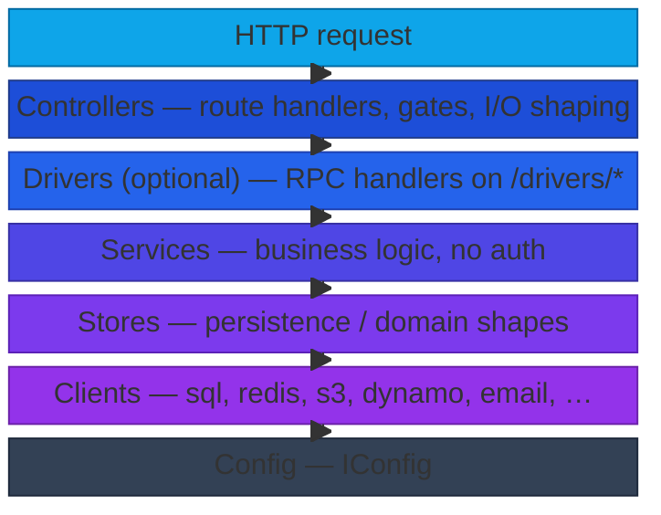

# Backend Architecture

Loosely inspired by the Controller–Service–Repository pattern with dependency injection. The backend is organized as a stack of layers where each layer only depends on the layers beneath it, and `PuterServer` ([src/backend/server.ts](../src/backend/server.ts)) instantiates each layer in order and hands the instances down to the next.

## Layers



Each layer only depends on the layers beneath it, and every dependency is injected through the constructor by `PuterServer`. Extensions sit alongside this stack and can register into any layer — see [Extensions](#extensions) below.

| Layer | Lives in | Responsibility |
| --- | --- | --- |
| **Controllers** | [src/backend/controllers/](../src/backend/controllers/) | Route handlers. Parse + validate input, apply per-route gates (auth, subdomain, rate limit, body parsers — see `RouteOptions`), call into services, format responses. |
| **Drivers** | [src/backend/drivers/](../src/backend/drivers/) | Optional. RPC-style handlers exposed over the `/drivers/*` surface (`puter-kvstore`, `puter-chat-completion`, …). A driver is a thin shell that validates RPC inputs and calls into services/stores; controllers can hold a typed reference to drivers when they need the same logic over HTTP. |
| **Services** | [src/backend/services/](../src/backend/services/) | Business logic. Assume the caller is already authenticated/authorized — services do not run auth gates themselves. |
| **Stores** | [src/backend/stores/](../src/backend/stores/) | Persistence and storage logic. Wraps clients with the domain shape services consume (rows, entities, KV namespaces). |
| **Clients** | [src/backend/clients/](../src/backend/clients/) | Adapters for external/internal services (sql, redis, s3, dynamodb, email, event bus, …). Knows protocols, not domain concepts. |
| **Config** | `config.*.json` → `IConfig` | The flat, typed config object every layer receives at construction. |

Each layer receives the layers beneath it through its constructor, so dependencies are explicit and traceable from `PuterServer`. A controller does not reach into a client directly; if it needs one, the right move is usually a service.

## Entry point: `PuterServer`

`PuterServer` is the bootstrap. It:

1. Loads any configured extension directories (`config.extensions`) so extensions can register before instantiation begins.
2. Instantiates each layer in order — clients → stores → services → drivers → controllers — merging in anything extensions have registered for that layer.
3. Wires global middleware, mounts controller routes through `PuterRouter` (which translates `RouteOptions` into the gate/parser middleware chain), and mounts extension routes through the same materializer.
4. Fires `onServerStart` hooks across every layer once HTTP is listening, and `onServerPrepareShutdown` / `onServerShutdown` on the way down.

## Context (ALS)

We use [`Context`](../src/backend/core/context.ts) — backed by `AsyncLocalStorage` — to carry per-request state without threading it through every function signature. It is used **sparingly**, mostly for `actor` and `req`. The request-context middleware opens a scope per request after the auth probe runs; anything inside a request handler can call `Context.get('actor')` / `Context.get('req')` instead of plumbing it as an argument.

Prefer explicit arguments. Reach for `Context` only when the value is truly request-scoped and would otherwise need to thread through many layers.

## Extensions

Extensions live alongside core ([packages/puter/extensions/](../extensions/)) and parallel the layered stack. They are meant for **non-crucial parts of the system** — things Puter still works without if removed.

- **Good extensions**: [thumbnails](../extensions/thumbnails.ts), [serverInfo](../extensions/serverInfo.ts), [devWatcher](../extensions/devWatcher.ts) — opt-in features cleanly bolted on.
- **Should probably be core**: [metering](../extensions/metering.ts), [appTelemetry](../extensions/appTelemetry.ts) — clients now expect these to be present, so the "extension" framing is misleading.
- **Shouldn't have been an extension**: [whoami](../extensions/whoami.ts) — it's load-bearing for every authenticated client. Keep this one in mind as a cautionary example when deciding whether something belongs in an extension.

### Extension API

The `extension` global ([src/backend/extensions.ts](../src/backend/extensions.ts)) exposes:

- **Layer registration** for first-class additions:
  - `extension.registerClient(name, ClientClass)`
  - `extension.registerStore(name, StoreClass)`
  - `extension.registerService(name, ServiceClass)`
  - `extension.registerDriver(name, DriverClass)`
  - `extension.registerController(name, ControllerClass)`
- **Lightweight wrappers** for the common case where a full class isn't worth it:
  - `extension.on(event, handler)` — subscribe to event-bus events.
  - `extension.get(path, opts?, handler)` / `.post` / `.put` / `.delete` / `.patch` / `.head` / `.options` / `.all` / `.use` — register routes. The `opts` shape is the same `RouteOptions` controllers use, so `subdomain`, `requireAuth`, `adminOnly`, body parsers, etc. all work identically.
- **Cross-layer access**: `extension.import('client' | 'store' | 'service' | 'controller' | 'driver')` returns a lazy proxy to instantiated objects, and `extension.config` exposes the live config.

```ts
import { extension } from '@heyputer/backend/src/extensions';

const services = extension.import('service');

extension.get('/healthcheck/deep', { subdomain: 'api', adminOnly: true }, async (_req, res) => {
    res.json({ ok: await services.health.runDeepCheck() });
});

extension.on('user.signup', (_key, data) => {
    console.log('new user', data.user.username);
});
```

## Conventions

- **TypeScript preferred** in new code where feasible. Existing JS is fine; convert opportunistically when you're already touching a file.
- **`camelCase`** for variable/function names; **`PascalCase`** for classes and for files that contain a class (`AuthService.ts`, `KVStoreDriver.ts`).
- **Deduplicate**. If two services need the same logic, lift it into a util/helper rather than calling sideways across the same layer — services should not depend on other services for code reuse.
- **Don't reach across layers.** Controllers do not poke clients directly; services do not register routes. If you find yourself wanting to, that's usually a signal the abstraction is wrong.
