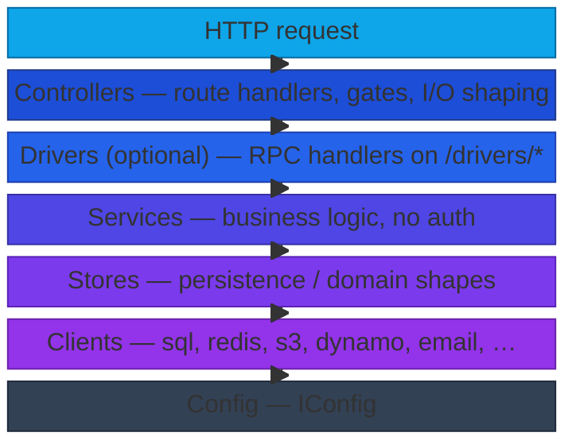

# Backend Architecture

Loosely inspired by the Controller–Service–Repository pattern with dependency injection. The backend is a stack of layers; each depends only on the layers beneath it and receives them through its constructor from `PuterServer` ([src/backend/server.ts](../src/backend/server.ts)), which instantiates the layers in order. The rules for working within the layers are in [AGENTS.md](../AGENTS.md#backend).

## Layers


```mermaid
block-beta
    columns 1
    REQ["HTTP request"]
    CTRL["Controllers — route handlers, gates, I/O shaping"]
    DRV["Drivers (optional) — RPC handlers on /drivers/*"]
    SVC["Services — business logic, no auth"]
    STR["Stores — persistence / domain shapes"]
    CLI["Clients — sql, redis, s3, dynamo, email, …"]
    CFG["Config — IConfig"]

    REQ --> CTRL
    CTRL --> DRV
    DRV --> SVC
    SVC --> STR
    STR --> CLI
    CLI --> CFG

    style REQ fill:#0ea5e9,stroke:#0369a1,color:#fff
    style CTRL fill:#1d4ed8,stroke:#1e3a8a,color:#fff
    style DRV fill:#2563eb,stroke:#1e40af,color:#fff
    style SVC fill:#4f46e5,stroke:#3730a3,color:#fff
    style STR fill:#7c3aed,stroke:#5b21b6,color:#fff
    style CLI fill:#9333ea,stroke:#6b21a8,color:#fff
    style CFG fill:#334155,stroke:#1e293b,color:#fff
```

| Layer | Lives in | Responsibility |
| --- | --- | --- |
| **Controllers** | [src/backend/controllers/](../src/backend/controllers/) | Route handlers. Parse + validate input, apply per-route gates (auth, subdomain, rate limit, body parsers — see `RouteOptions`), call into services, format responses. |
| **Drivers** | [src/backend/drivers/](../src/backend/drivers/) | Optional. RPC-style handlers exposed over the `/drivers/*` surface (`puter-kvstore`, `puter-chat-completion`, …). A driver is a thin shell that validates RPC inputs and calls into services/stores; controllers can hold a typed reference to drivers when they need the same logic over HTTP. |
| **Services** | [src/backend/services/](../src/backend/services/) | Business logic. Assume the caller is already authenticated/authorized — services do not run auth gates themselves. |
| **Stores** | [src/backend/stores/](../src/backend/stores/) | Persistence and storage logic. Wraps clients with the domain shape services consume (rows, entities, KV namespaces). |
| **Clients** | [src/backend/clients/](../src/backend/clients/) | Adapters for external/internal services (sql, redis, s3, dynamodb, email, event bus, …). Knows protocols, not domain concepts. |
| **Config** | `config.*.json` → `IConfig` | The flat, typed config object every layer receives at construction. |

Extensions sit alongside this stack and can register into any layer; see [Extensions](#extensions).

## Entry point: `PuterServer`

`PuterServer` is the bootstrap. It:

1. Loads any configured extension directories (`config.extensions`) so extensions can register before instantiation begins.
2. Instantiates each layer in order — clients → stores → services → drivers → controllers — merging in anything extensions have registered for that layer.
3. Wires global middleware, mounts controller routes through `PuterRouter` (which translates `RouteOptions` into the gate/parser middleware chain), and mounts extension routes through the same materializer.
4. Fires `onServerStart` hooks across every layer once HTTP is listening, and `onServerPrepareShutdown` / `onServerShutdown` on the way down.

## Context (ALS)

[`Context`](../src/backend/core/context.ts), backed by `AsyncLocalStorage`, carries per-request state without threading it through every function signature. The request-context middleware opens a scope per request after the auth probe runs, so anything inside a request handler can call `Context.get('actor')` / `Context.get('req')`. It's used sparingly, mostly for `actor` and `req`; see the [Context rule](../AGENTS.md#backend).

## Actors

An [`Actor`](../src/backend/core/actor.ts) is who a request is acting as. Its two app fields are not interchangeable: `app` is the app the actor carries *directly* (an app-under-user token), while `effectiveApp` is the app it ultimately acts as — its own, or the one that issued its access token. An access-token actor has no `app` of its own, so a gate that reads `app` answers "no app" for it and falls open.

`makeActor` resolves `effectiveApp` once at construction, and `assertResolvedActor` at the request edge rejects any actor that skipped it — so reading `effectiveApp` needs no fallback. Reach for `app` only where the direct app genuinely is the question, and say why in a comment.

- `actor.effectiveApp` — which app is acting. This is the default; nearly every scoping rule, namespace key and attribution wants it.
- `isAppActor(actor)` — a direct app actor specifically. Use it where a token must *not* be treated as its issuer, e.g. the permission scanners that read an app's own grant rows.
- `isPlainUserActor(actor)` — the account acting through nothing at all; `isAccountContext(actor)` for the wider "the account's own reach", which also admits a full-access token.

## Extensions

Extensions live in [extensions/](../extensions/), parallel the layered stack, and hold the parts of the system Puter still works without. [AGENTS.md](../AGENTS.md#extensions) has the rule for what belongs in one.

- **Good extensions**: [thumbnails](../extensions/thumbnails.ts), [serverInfo](../extensions/serverInfo.ts), [devWatcher](../extensions/devWatcher.ts) — opt-in features cleanly bolted on.
- **Should probably be core**: [metering](../extensions/metering.ts), [appTelemetry](../extensions/appTelemetry.ts) — clients now expect these to be present, so the "extension" framing is misleading.
- **Shouldn't have been an extension**: [whoami](../extensions/whoami.ts) — it's load-bearing for every authenticated client.

### Extension API

The `extension` global ([src/backend/extensions.ts](../src/backend/extensions.ts)) exposes:

- **Layer registration** for first-class additions:
  - `extension.registerClient(name, ClientClass)`
  - `extension.registerStore(name, StoreClass)`
  - `extension.registerService(name, ServiceClass)`
  - `extension.registerDriver(name, DriverClass)`
  - `extension.registerController(name, ControllerClass)`
- **Lightweight wrappers** for the common case where a full class isn't worth it:
  - `extension.on(event, handler)` — subscribe to event-bus events.
  - `extension.get(path, opts?, handler)` / `.post` / `.put` / `.delete` / `.patch` / `.head` / `.options` / `.all` / `.use` — register routes. The `opts` shape is the same `RouteOptions` controllers use, so `subdomain`, `requireAuth`, `adminOnly`, body parsers, etc. all work identically.
- **Cross-layer access**: `extension.import('client' | 'store' | 'service' | 'controller' | 'driver')` returns a lazy proxy to instantiated objects, and `extension.config` exposes the live config.

```ts
import { extension } from '@heyputer/backend/src/extensions';

const services = extension.import('service');

extension.get('/healthcheck/deep', { subdomain: 'api', adminOnly: true }, async (_req, res) => {
    res.json(await services.health.getStatus());
});

extension.on('puter.signup.success', (_key, data) => {
    console.log('new user', data.username);
});
```

The `app.recommended` event lets extensions customize desktop recommendations.
Its `appNames` array starts as a fresh copy of the default ordered names on each
call. Listeners may mutate or replace it, including setting it to an empty array.
Async listeners are awaited before names are resolved to app summaries; names
that do not exist are skipped.

```ts
extension.on('app.recommended', (_key, data) => {
    data.appNames = ['editor', 'camera'];
});
```
