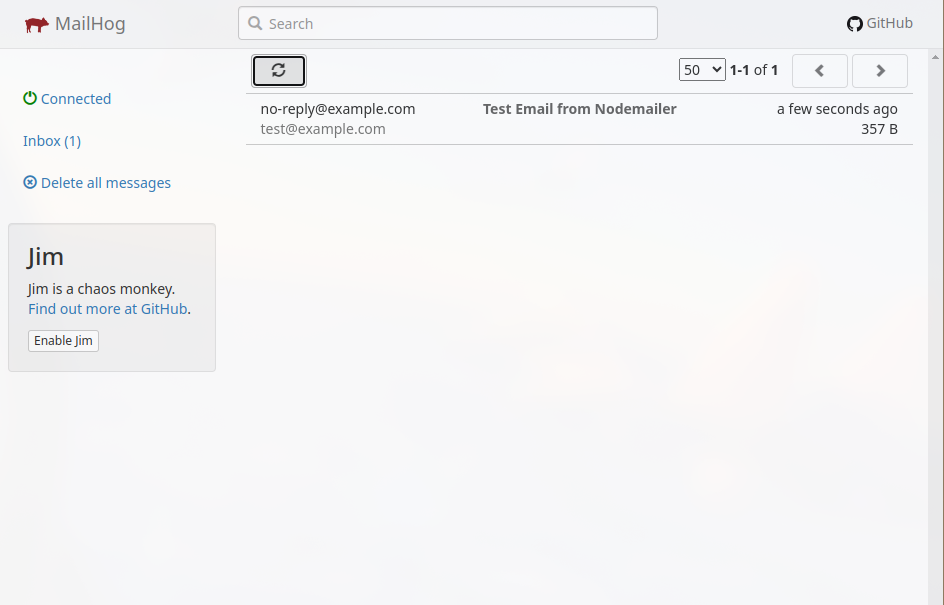

# Local Email Testing

This guide describes how to set up and use [MailHog](https://github.com/mailhog/MailHog) for local email testing in Puter development. MailHog provides a local email server that captures outgoing emails for testing purposes without actually sending them to real recipients.

## Setup

### 1. Configure Puter

Add the following configuration to your `volatile/config/config.json` file:

```json
"email": {
  "host": "localhost",
  "port": 1025
}
```

### 2. Install MailHog

Download and run MailHog on your local machine:

```bash
# Install MailHog
wget https://github.com/mailhog/MailHog/releases/download/v1.0.1/MailHog_linux_amd64
chmod +x MailHog_linux_amd64
./MailHog_linux_amd64
```

### 3. Install Nodemailer

Install Nodemailer to send test emails to the SMTP server:

```bash
npm install nodemailer
```

## Using MailHog

### Access Web Interface

Once MailHog is running, access the web interface at:
[http://127.0.0.1:8025/](http://127.0.0.1:8025/)

All captured emails and their recipients will be displayed in this interface.

### Testing Your MailHog Setup with Nodemailer

You can verify that your MailHog instance is working correctly by creating a simple test script using Nodemailer. This allows you to send test emails that will be captured by MailHog without actually delivering them to real recipients.

Here's a sample script you can use to test your MailHog setup:

```javascript
import nodemailer from "nodemailer";

// Configure transporter to use MailHog
const transporter = nodemailer.createTransport({
    host: "localhost", // MailHog SMTP server address
    port: 1025,        // Default MailHog SMTP port
    secure: false      // No SSL/TLS required for MailHog
});

// Define a test email
const mailOptions = {
    from: "no-reply@example.com",
    to: "test@example.com",
    subject: "Hello from Nodemailer!",
    text: "This is a test email sent using Nodemailer."
};

// Send the test email
transporter.sendMail(mailOptions)
    .then(info => console.log("Email sent:", info.response))
    .catch(error => console.error("Error:", error));
```

After sending an email with this script, you can view it in the MailHog web interface:

### How Puter Uses Nodemailer

Puter itself uses Nodemailer for sending emails through its `EmailService` class located in `/src/backend/src/services/EmailService.js`. This service handles various email templates for:

- Account verification
- Password recovery
- Two-factor authentication notifications
- File sharing notifications
- App approval notifications
- And more

The service creates a Nodemailer transport using the configuration from your `config.json` file, which is why setting up MailHog correctly is important for testing Puter's email functionality during development.



## Troubleshooting

If you encounter issues with MailHog:

1. Check if MailHog is running:
   ```bash
   ps aux | grep MailHog
   ```

2. Ensure the correct port configurations in both MailHog and your application.

3. Check for any error messages in the MailHog console output.

