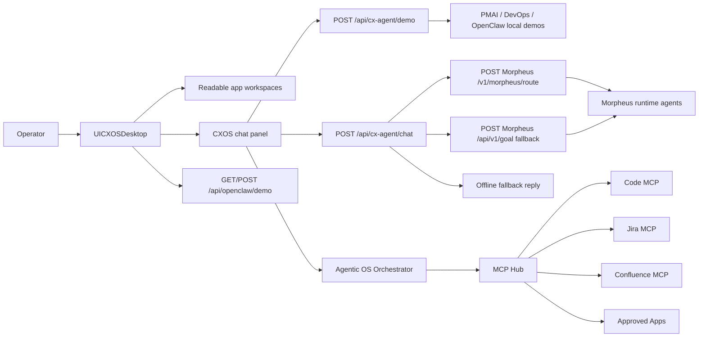

# Havas Agentic OS Architecture

This design matches the inspected CXOS backend and UI contracts. The current implementation now includes a live demo-grade MCP hub, typed tool contracts, encrypted auth references, append-only audit persistence, and desktop windows for Code, Jira, Confluence, command palette, and task monitoring.

## MCP Hub And Apps

- MCP Hub is the governed tool boundary for external apps and repository actions.
- Approved Apps expose scoped capabilities such as code search, branch inspection, Jira issue triage, and Confluence knowledge lookup.
- Each app must declare read scopes, write scopes, approval mode, audit fields, retry policy, and fallback behavior before being enabled in a demo.
- MCP results are treated as evidence payloads for the Orchestrator, not direct UI state mutation.
- Auth payloads are stored as encrypted references in process memory and never exposed in route payloads or audit logs.
- Audit events are appended to disk as JSONL via `HAVAS_AGENTIC_OS_AUDIT_FILE` or `.havas-agentic-os-audit.jsonl`.

## Orchestrator Contract

- The Orchestrator receives operator intent from chat or workspace actions.
- It resolves the target app, prefers MCP tools, checks permissions, requests approval when required, and calls MCP Hub.
- Read actions may return summarized evidence to chat or a workspace card.
- Write actions must include actor, target, diff or payload summary, approval id, and rollback note.
- Task Monitor surfaces tool-selection, tool-call, approval, and error chain state from orchestrator runs.

## Runtime Contracts

- `POST /api/cx-agent/chat` accepts `message`, `agent`, `history`, optional `projectRef`, and optional `actor`.
- `POST /api/cx-agent/demo` accepts `feature` and `arg`; valid features are `pmai`, `devops`, and `openclaw`.
- `GET/POST /api/openclaw/demo` returns the OpenClaw local demo payload.
- Morpheus defaults to `http://localhost:3550`; `MORPHEUS_URL`, `MORPHEUS_SECRET`, or `config.cx_agent` can override it.
- MCP Hub is served through `/api/havas-agentic-os/mcp/*` and currently ships demo adapters for Code, Jira, and Confluence.
- MCP tool contracts now expose tool schema, action type, retry metadata, approval mode, permission decision, audit id, and timestamp.

## Fallback Limits

- Demo commands (`/pmai`, `/devops`, `/openclaw`, `/brief`, `/audit`, `/deploy`) do not require Morpheus.
- Unknown or undiscovered agents summon a local demo workspace.
- If Morpheus route fails, the backend tries `/api/v1/goal`; if that also fails, it returns the offline message.
- UI chat history is local browser state under `cxos.chat.<agent>`, not a durable backend audit log.
- MCP write claims must be shown as proposed actions unless an attached runtime returns audit evidence.
- Jira and Confluence remain demo adapters until real MCP server credentials and external connectors are attached.
