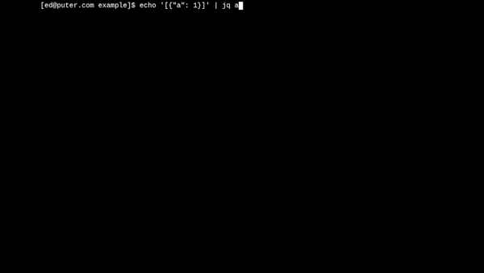

<h2 align="center">Phoenix</h2>
<h3 align="center">Puter's pure-javascript shell</h3>
<h3 align="center"></h3>
<hr>

`phoenix` is a pure-javascript shell built for [puter.com](https://puter.com).
Following the spirit of open-source initiatives we've seen like
[SerenityOS](https://serenityos.org/),
we've built much of the shell's functionality from scratch.
Some interesting portions of this shell include:
- A shell parser which produces a Concrete-Syntax-Tree
- Pipeline constructs built on top of the [Streams API](https://developer.mozilla.org/en-US/docs/Web/API/Streams_API)
- Platform support for Puter

The shell is a work in progress. The following improvements are considered in-scope:
- Anything specified in [POSIX.1-2017 Chapter 2](https://pubs.opengroup.org/onlinepubs/9699919799.2018edition/utilities/V3_chap02.html)
- UX improvements over traditional shells
  > examples include: readline syntax highlighting, hex view for binary streams
- Platform support, so `phoenix` can run in more environments

## Running Phoenix

### In a Browser

You can use the [terminal on Puter](https://puter.com/app/terminal), including self-hosted installations.

### Running in Node

Under node.js Phoenix acts as a shell for your operating system.
This is a work-in-progress and lots of things are not working
yet. If you'd like to try it out you can run `src/main_cli.js`.
Check [this issue](https://github.com/HeyPuter/phoenix/issues/14)
for updated information on our progress.

## Testing

You can find our tests in the [test/](./test) directory.
Testing is done with [mocha](https://www.npmjs.com/package/mocha).
Make sure it's installed, then run:

```sh
npm test
```

## What's on the Roadmap?

We're looking to continue improving the shell and broaden its usefulness.
Here are a few ideas we have for the future:

- local machine platform support
  > See [this issue](https://github.com/HeyPuter/phoenix/issues/14)
- further support for the POSIX Command Language
  > Check our list of [missing features](doc/missing-posix.md)

