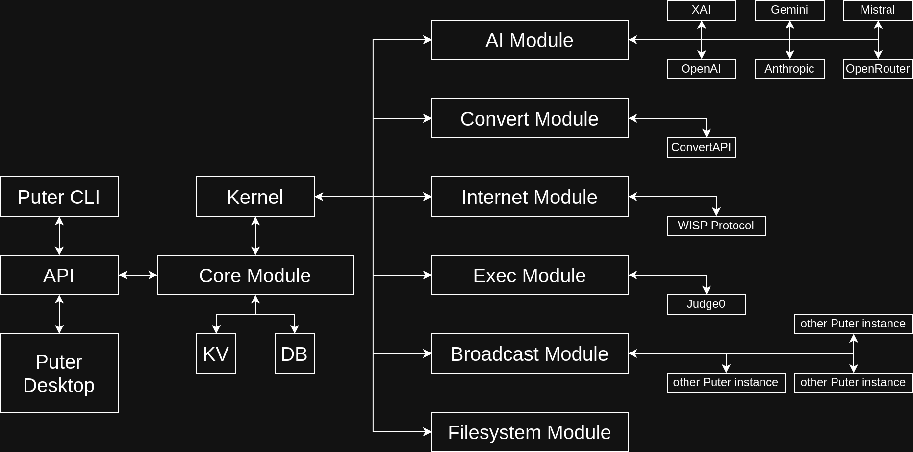

# Puter Backend

_Part of a High-Level Distributed Operating System_

Whether or not you call Puter an operating system
(we call it a "high-level distributed operating system"),
**operating systems for devices** 
are a useful reference point to describe the architecture of Puter.
If Puter's "hardware" is services, and Puter's "userspace" is the
client side of the API, then Puter's "kernel" is the backend.

Puter's backend is composed of:
- The **Kernel** class, which is responsible for initialization
- A number of **Modules** which are registered in **Kernel** for a customized
  Puter instance.
- Many **Services** which are contained inside modules.

## Documentation

- [Backend File Structure](./doc/contributors/structure.md)
- [Boot Sequence](./doc/contributors/boot-sequence.md)
- [Kernel](./doc/Kernel.md)
- [Modules](./doc/contributors/modules.md)

## Can I use Puter's Backend Alone?

Puter's backend is not dependent on Puter's frontned. In fact, you could
prevent Puter's GUI from ever showing up by disabling PuterHomepageModule.
Similarly, you can run Puter's backend with no modules loaded for a completely
blank slate, or only include CoreModule and WebModule to quickly build your
own backend that's compatible with any of Puter's services.

## What can it do?

Puter's Kernel only initializes modules, nothing more. The modules bring a lot
of capabilities to the table, however. Within this directory you'll find modules that:
- coerce all the well-known AI services to a common interface
- manage authentication with Wisp servers (this brings TCP to the browser!)
- manage apps on Puter
- allow a user to host websites from Puter
- provide persistent key-value storage to Puter's desktop and apps
- provide a fast filesystem implementation
- communicate with other instances of Puter's backend,
  secured with elliptic curve cryptography
- provide more services like converting files and compiling low-level code.

