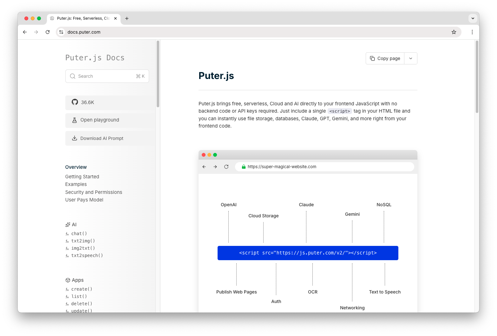

<h3 align="center">Puter.js Docs</h3>

<p align="center">
    <a href="https://docs.puter.com/?ref=github.com">Docs</a>
    ·
    <a href="https://developer.puter.com/?ref=github.com">Developer</a>
    ·
    <a href="https://puter.com/?ref=github.com">Puter.com</a>
    ·
    <a href="https://discord.com/invite/PQcx7Teh8u">Discord</a>
    ·
    <a href="https://reddit.com/r/puter">Reddit</a>
    ·
    <a href="https://twitter.com/HeyPuter">X</a>
</p>

<h3 align="center"></h3>

<br/>

## Puter.js Docs

The Puter.js documentation contains everything you need to build powerful applications with Puter.js.

- Get started with Puter.js by reading documentations on usage and best practices
- Browse all available APIs, including AI, networking, authentication, and cloud services
- Find code examples and implementations to speed up your development

<br/>

## Getting Started

### 💻 Local Development

```bash
git clone https://github.com/HeyPuter/docs
cd docs
npm install
npm run dev
```

**→** This should launch Puter.js Docs at
<font color="red"> http://127.0.0.1:8080 (or the next available port). </font>

<br/>

## Support

Connect with the maintainers and community through these channels:

- Bug report or feature request? Please [open an issue](https://github.com/HeyPuter/docs/issues/new).
- Discord: [discord.com/invite/PQcx7Teh8u](https://discord.com/invite/PQcx7Teh8u)
- X (Twitter): [x.com/HeyPuter](https://x.com/HeyPuter)
- Reddit: [reddit.com/r/puter/](https://www.reddit.com/r/puter/)
- Mastodon: [mastodon.social/@puter](https://mastodon.social/@puter)
- Security issues? [security@puter.com](mailto:security@puter.com)
- Email maintainers at [hi@puter.com](mailto:hi@puter.com)

We are always happy to help you with any questions you may have. Don't hesitate to ask!

<br/>

## License

This repository, including its sub-projects, modules, and components, is licensed under [MIT](https://github.com/HeyPuter/docs/blob/main/LICENSE-CODE.txt), and its content is licensed under [CC BY-SA 4.0](https://github.com/HeyPuter/docs/blob/main/LICENSE.txt) unless explicitly stated otherwise. Third-party libraries included in this repository may be subject to their own licenses.
