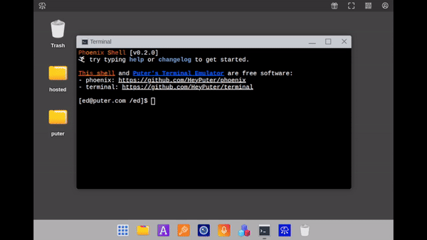

<h3 align="center"></h3>
<h3 align="center">Puter Terminal Emulator</h3>

    <a href="https://puter.com/app/terminal"><strong>« LIVE DEMO »</strong></a>
     
     
    <a href="https://puter.com">Puter.com</a>
    ·
    <a href="https://discord.com/invite/PQcx7Teh8u">Discord</a>
    ·
    <a href="https://reddit.com/r/puter">Reddit</a>
    ·
    <a href="https://twitter.com/HeyPuter">X (Twitter)</a>

<h3 align="center">
</h3>

This is a [Puter](https://puter.com)-compatible pure-javascript terminal emulator
built on [xtermjs](https://xtermjs.org/).
It integrates with an external shell provider.
We develop and test the terminal emulator alongside [Puter's shell: phoenix](../phoenix).

## The Terminal as a Whole

This terminal emulator alongside `phoenix` give you an AGPL-3.0-licensed pure-javascript
terminal experience which integrates with Puter's filesystem, AI services, and more.

Here are a few examples of what you can do:
- `ai "write me a story"`
- `txt2img "a blue computer on a cloud" > puter.png`
- `neofetch`
- `echo $(echo "command substitution")`
- `cat example.txt | grep "find me"`
- `cat example.json | jq "name"`
